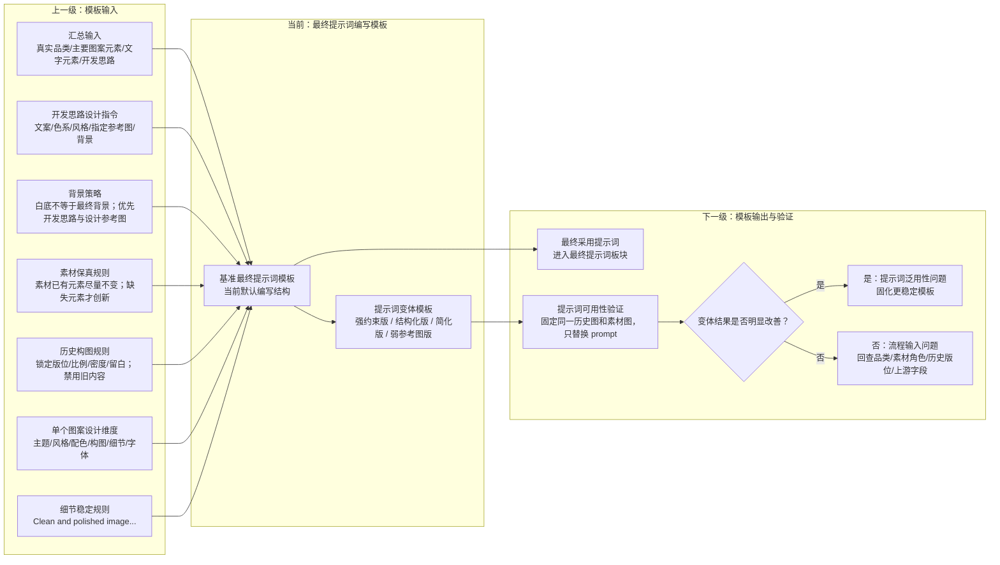

# 最终提示词编写模板局部视图

本视图只保留“最终提示词编写模板”的上一级输入和下一级输出，用来排查问题到底来自流程输入，还是提示词模板的泛用性。

```mermaid
flowchart LR
  subgraph Upstream["上一级：模板输入"]
    PromptInputs["汇总输入<br/>真实品类/主要图案元素/文字元素/开发思路"]
    DevDirectives["开发思路设计指令<br/>文案/色系/风格/指定参考图/背景"]
    BackgroundRule["背景策略<br/>白底不等于最终背景；优先开发思路与设计参考图"]
    MaterialRule["素材保真规则<br/>素材已有元素尽量不变；缺失元素才创新"]
    HistoryRule["历史构图规则<br/>锁定版位/比例/密度/留白；禁用旧内容"]
    DesignDimension["单个图案设计维度<br/>主题/风格/配色/构图/细节/字体"]
    QualityRule["细节稳定规则<br/>Clean and polished image..."]
  end

  subgraph Template["当前：最终提示词编写模板"]
    BasePrompt["基准最终提示词模板<br/>当前默认编写结构"]
    PromptVariants["提示词变体模板<br/>强约束版 / 结构化版 / 简化版 / 弱参考图版"]
  end

  subgraph Downstream["下一级：模板输出与验证"]
    FinalPrompt["最终采用提示词<br/>进入最终提示词板块"]
    PromptUsabilityTest["提示词可用性验证<br/>固定同一历史图和素材图，只替换 prompt"]
    PromptDiagnosis{"变体结果是否明显改善？"}
    PromptTemplateIssue["是：提示词泛用性问题<br/>固化更稳定模板"]
    PromptFlowIssue["否：流程输入问题<br/>回查品类/素材角色/历史版位/上游字段"]
  end

  PromptInputs --> BasePrompt
  DevDirectives --> BasePrompt
  BackgroundRule --> BasePrompt
  MaterialRule --> BasePrompt
  HistoryRule --> BasePrompt
  DesignDimension --> BasePrompt
  QualityRule --> BasePrompt

  BasePrompt --> FinalPrompt
  BasePrompt --> PromptVariants
  PromptVariants --> PromptUsabilityTest
  PromptUsabilityTest --> PromptDiagnosis
  PromptDiagnosis -- "是" --> PromptTemplateIssue
  PromptDiagnosis -- "否" --> PromptFlowIssue
```

验证时只允许替换最终提示词，不替换历史图、空版式母版、素材图、品类判断和上游字段。
