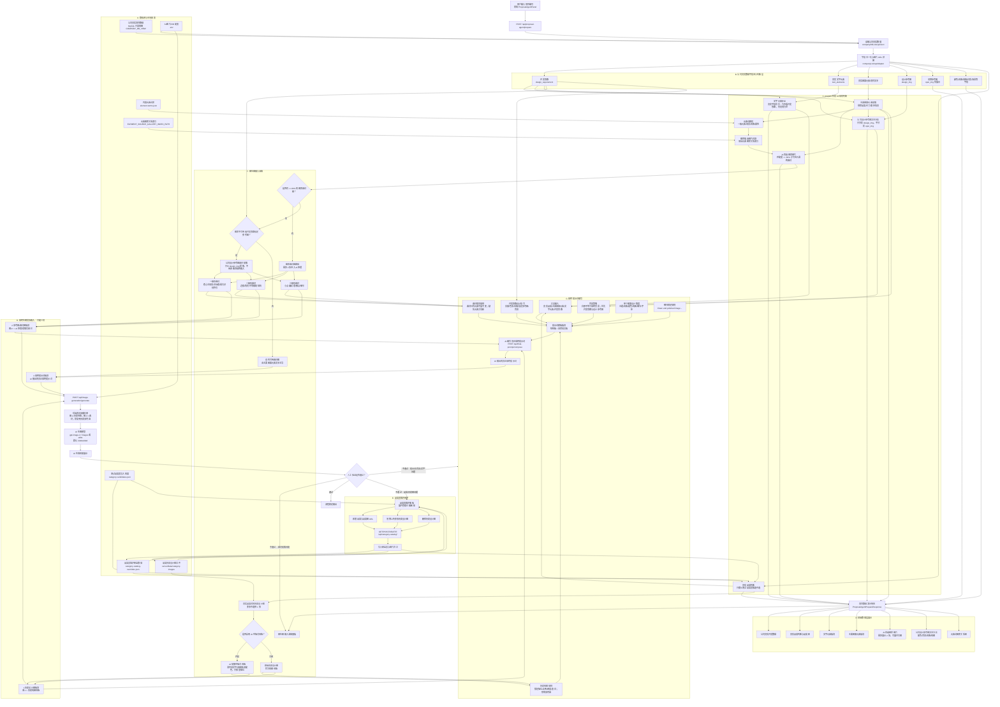
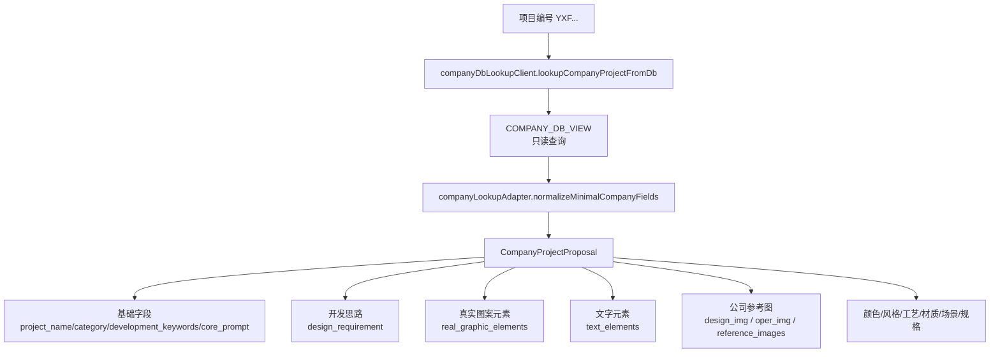
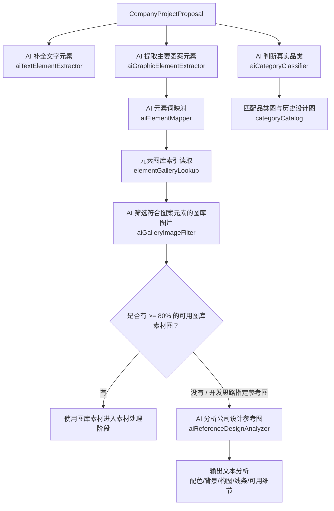
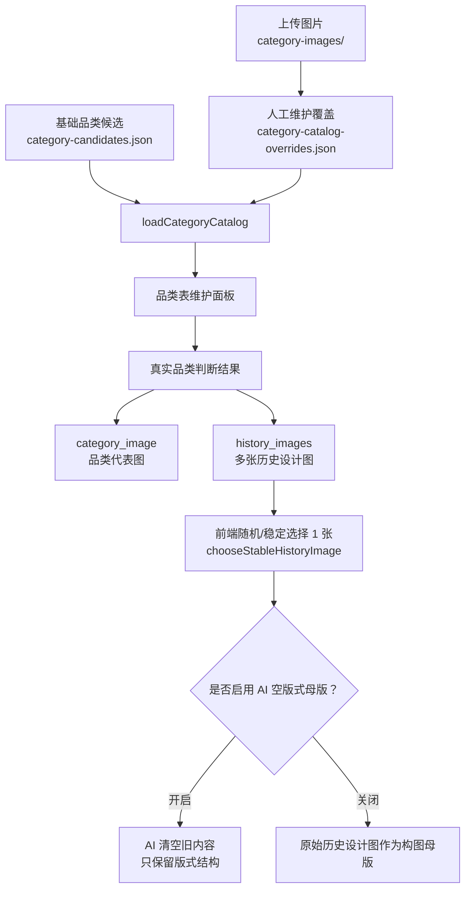
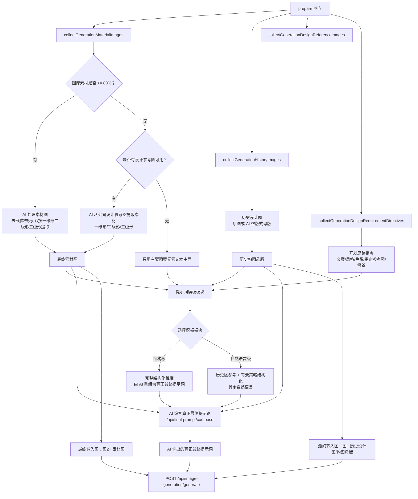
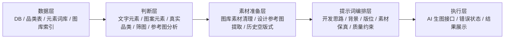

# MYML Evidence Agent 实现逻辑流程图

本文用于拆分当前 Agent 项目的实现边界：数据从哪里来、有哪些“表/文件/视图”、在哪里接入、AI 在哪些节点做判断或执行。

## 1. 完整总流程

这张图是完整业务闭环：左上是数据来源，中段是 prepare 阶段判断，右侧/下段是前端数据层与品类维护，最后收敛到“历史设计图板块 + 参考图板块 + 最终提示词”三块输入，再进入 AI 生图和人工验证回流。

## 2. 后端接口与接入位置

| 接口 | 前端调用 | 后端入口 | 作用 |
| --- | --- | --- | --- |
| `POST /api/proposal-agent/prepare` | `src/api/proposalApi.ts` | `server/index.js` | 按项目编号读取公司数据，并完成 AI 判断链路。 |
| `POST /api/company-project/lookup` | 兼容入口 | `server/index.js` | 与 prepare 同逻辑，保留兼容。 |
| `GET /api/category-catalog` | `src/api/proposalApi.ts` | `server/services/categoryCatalog.js` | 读取品类表、品类图、历史设计图状态。 |
| `POST /api/category-catalog/entries` | `src/api/proposalApi.ts` | `server/services/categoryCatalog.js` | 新增/覆盖品类与品类图 URL。 |
| `POST /api/category-catalog/entries/image` | `src/api/proposalApi.ts` | `server/services/categoryCatalog.js` | 拖拽上传品类历史设计图。 |
| `DELETE /api/category-catalog/entries/image` | `src/api/proposalApi.ts` | `server/services/categoryCatalog.js` | 删除品类历史设计图。 |
| `POST /api/final-prompt/compose` | `src/api/proposalApi.ts` | `server/services/aiFinalPromptComposer.js` | AI 结合素材图、历史版式母版和当前模板板块，输出真正最终提示词。 |
| `POST /api/image-generation/generate` | `src/api/proposalApi.ts` | `server/services/aiImageGenerator.js` | AI 处理素材、提取空版式、最终生图都走这个接口。 |

## 3. 数据来源与“表/文件”

| 数据源 | 类型 | 配置/路径 | 主要字段或内容 | 用途 |
| --- | --- | --- | --- | --- |
| 公司项目真实数据 | MySQL 只读视图 | `.env` 的 `COMPANY_DB_VIEW` | 项目编号、项目名称、开发思路、文字元素、设计参考图、运营参考图、颜色、风格、规格等 | 主数据源。后端只做 `SELECT * FROM <view> WHERE <project_code_column> = ? LIMIT 1`。 |
| 品类候选表 | JSON，由测试品类表导入 | `server/data/category-candidates.json` | 品类名称列表 | 限定真实品类判断只能从候选品类中选择。 |
| 品类维护覆盖表 | JSON | `server/data/category-catalog-overrides.json` | 品类图、备注、历史设计图列表 | 前端“品类表维护”新增品类、补图、拖拽历史设计图都会写这里。 |
| 品类图片文件夹 | 文件目录 | `server/data/category-images/` | 上传后的图片文件 | 拖拽上传历史设计图的落盘目录，经 `/category-images/...` 暴露。 |
| 内置元素词库 | JSON | `server/data/element-terms.json` | 元素词条 | 规则匹配项目文本中的元素词。 |
| 元素图库关系索引 | JSON，只读 | `.env` 的 `ELEMENT_SOURCE_GALLERY_INDEX_PATH` 或 `MYML_DESIGN_KNOWLEDGE_BASE_PATH` | 元素词与图库候选图片关系 | 找到“元素词图库关系图”和图库候选图片。 |
| 公司参考图 | 公司 DB 字段解析 | `design_img` / `oper_img` + `COMPANY_REFERENCE_IMAGE_BASE_URL` | 设计参考图、运营参考图 URL | 设计参考图参与设计分析与素材提取；运营参考图展示但不进入设计参考分析。 |
| AI 生成结果 | 上游模型返回 | `AI_IMAGE_GENERATOR_*` | url/base64/revised_prompt | 素材提取图、空版式母版、最终生成图。 |

## 4. 公司数据读取与字段归一化

实现位置：

- `server/services/companyDbLookupClient.js`：读取 `.env` 的 DB 配置，执行只读参数化查询。
- `server/services/companyLookupAdapter.js`：字段别名映射、图片 URL 拼接、响应聚合。
- `src/types/proposal.ts`：前后端共享的数据结构。

## 5. AI 判断链路

AI 判断点：

| AI 节点 | 文件 | 输入 | 输出 | 当前用途 |
| --- | --- | --- | --- | --- |
| 文字元素补全 | `server/services/aiTextElementExtractor.js` | 公司真实字段，重点看 `text_elements`；为空时看 `design_requirement` | `proposal.text_elements` | 最终提示词的必须文字。 |
| 图案元素提取 | `server/services/aiGraphicElementExtractor.js` | 项目名称与开发信息 | `proposal.ai_graphic_elements` | 主图案元素，进入筛图、参考图分析、最终提示词。 |
| 元素词映射 | `server/services/aiElementMapper.js` | 项目字段 + 内置元素词库 | 一级元素词、场景词、风格词、属性词 | 驱动图库关系图和候选图片。 |
| 真实品类判断 | `server/services/aiCategoryClassifier.js` | 公司项目字段 + 品类候选表 | `predicted_category`、置信度、品类图、历史图 | 决定真实品类和历史设计图来源。 |
| 图库图片筛选 | `server/services/aiGalleryImageFilter.js` | 必须图案元素 + 图库候选图片 | `selected_gallery_images`、匹配概率 | 只有匹配度 `>= 80%` 才进入最终素材流程。 |
| 公司设计参考图分析 | `server/services/aiReferenceDesignAnalyzer.js` | `design_img`，主要图案元素，图库筛选状态 | 文本化设计信息、背景信息、配色等 | 图库素材不可用或开发思路指定参考图时，补充最终提示词。 |
| 最终提示词编写 | `server/services/aiFinalPromptComposer.js` | 历史版式母版 + 素材图 + 提示词模板板块 | `final_prompt`、`prompt_strategy`、`warnings` | 生图前由 AI 结合真实输入图重写真正最终提示词。 |
| 生图/图生图执行 | `server/services/aiImageGenerator.js` | prompt + input_images | 生成图片 | 素材清理、参考图素材提取、空版式提取、最终图案生成。 |

## 6. 品类表维护与历史设计图

注意：

- 一个品类可以有多张历史设计图。
- 删除历史图时，如果删除的是当前代表图，会自动切换到该品类剩余历史图中的最新一张。
- 最近新增了“最终生成使用 AI 空版式母版”开关：开启时自动提取空版式；关闭时直接把原始历史图作为图 1 构图母版。

## 7. 图生图输入准备

前端实现位置：

- `src/components/ProposalAgentPanel.tsx`
  - `collectGenerationMaterialImages`
  - `collectGenerationHistoryImages`
  - `chooseStableHistoryImage`
  - `collectGenerationDesignReferenceImages`
  - `buildMaterialRefinementPrompt`
  - `buildDesignReferenceMaterialSplitPrompt`
  - `buildHistoryLayoutExtractionPrompt`
  - `buildImageToImagePrompt`
  - `composeFinalPrompt`
  - `buildFinalGenerationInputImages`

## 8. 最终生图输入约束

最终提交给后端生图模型时，输入被整理成三个板块：

1. 参考图板块
   - 不是原始渠道图。
   - 优先使用 AI 处理后的图库素材图。
   - 图库素材不可用时，使用公司设计参考图 AI 提取后的素材。
   - 素材最多 3 张，对应一级形、二级形、三级形。

2. 历史设计图板块
   - 作为图 1。
   - 角色始终是历史设计图/构图母版。
   - 可以选择使用 AI 空版式母版，也可以直接使用原始历史设计图。

3. 最终提示词
   - 前端先生成“提示词模板板块”，不是直接提交给生图模型。
   - 模板板块分为两类：
     - 结构板：所有设计维度都结构化，包括输入图角色、真实品类、主要图案元素、文字元素、素材使用、历史版式、背景策略、单个版位设计维度、质量约束和禁止偏离。
     - 自然语言板：只把“历史设计图怎么参考”和“背景策略怎么实施”做成结构化规则，其余用自然语言表达，例如“用素材图替换掉历史设计图中的设计主题，生成一张新的设计图”。
   - 点击“AI 编写最终提示词”或点击“AI 生成图案”时，会先把图 1 历史版式母版、图 2+ 素材图和当前模板板块提交给 `POST /api/final-prompt/compose`。
   - `aiFinalPromptComposer` 输出的 `final_prompt` 才是真正进入生图模型的最终提示词。
   - 当前验证结论：加入“AI 通过素材图和版式母版重写真正最终提示词”后，最终图案可用性明显提高；该步骤应作为稳定流程保留。

后端 `aiImageGenerator` 会再次强化顺序：

- 图 1/第一张输入图 = 历史设计图/构图母版。
- 图 2 及以后 = 素材图/素材本体来源。
- `requestMode=edits` 时走 `/images/edits` 表单上传图片。
- `requestMode=images/chat` 时按配置构造 JSON 请求。
- 当前 `.env.example` 默认生图尺寸为 `2048x2048`。

## 9. 前端数据层板块

| 板块 | 数据来源 | 用途 |
| --- | --- | --- |
| 公司真实开发数据 | `proposal` | 展示公司 DB 真实字段，作为事实底座。 |
| 品类表维护 | `categoryCatalog` | 补新品类、品类图、多张历史设计图。 |
| 真实品类判断 | `category_judgment` | 展示 AI 判断的真实品类、置信度、品类图和历史图。 |
| 图案元素 | `ai_graphic_elements` / `real_graphic_elements` | 确定最终生成必须围绕的核心元素。 |
| 文字元素 | `text_elements` | 最终提示词中的必须文字。 |
| 元素词库关系图 | `element_terms` + `element_gallery` | 展示元素词到图库候选图片的关系。 |
| AI 筛选符合图案元素的图片 | `selected_gallery_images` | 最多展示两张，高于 80% 才能进入最终生成。 |
| 公司参考图文本分析 | `reference_design_analysis` | 当图库素材不可用或开发思路指定参考图时，用设计参考图提供文字化设计信息。 |
| 图生图输入准备 | 前端聚合 | 汇总素材图、历史图和提示词模板板块，先触发 AI 编写真正最终提示词，再触发生图。 |
| 最终生图实际输入 | `lastGenerationInput` | 显示最近一次真正提交给后端的 AI 输出 final_prompt 和 input_images。 |

## 10. 推荐拆分方式

建议后续拆成这些模块：

1. 数据源适配层
   - 公司 DB 只读视图适配。
   - 品类表维护。
   - 元素图库索引读取。

2. AI 判断层
   - 文字元素补全。
   - 图案元素提取。
   - 真实品类判断。
   - 图库图片筛选。
   - 公司设计参考图文本分析。

3. 生成素材层
   - 渠道素材图清理。
   - 公司设计参考图素材提取。
   - 历史空版式提取。

4. 最终生成层
   - 提示词模板板块构造。
   - AI 结合素材图和历史版式母版编写真正最终提示词。
   - 最终输入图排序与角色约束。
   - 生图接口调用。
   - 结果与错误展示。

5. 审核/验证层
   - 最终生图实际输入快照。
   - 对比结构板与自然语言板输出的真正最终提示词。
   - 匹配概率阈值检查。
   - 历史图内容禁用检查。
   - 素材图是否被真实使用的验证。

## 11. 组合品类执行规则

组合品类不共用一轮素材结果。命中几个真实品类，就创建几个互相独立的完整生成任务；网页默认自动流程与 Canvas `final-display` 使用相同规则。

每个品类任务都独立执行：

1. 按该品类重新判断内部图库素材层级并生成素材图。
2. 按该品类重新判断公司设计参考图层级并提取素材图。
3. 匹配该品类自己的历史设计图；开启 AI 空版式时，也单独提取该品类的空版式母版。
4. 只使用该品类本轮生成的素材和历史母版编写真正最终提示词。
5. 独立提交一次最终图生图，结果标记所属品类。

因此，两个品类会形成两套素材、两张历史模板、两份最终提示词和两次最终生图；不会把第一套素材板复制给第二个品类。

## 12. 开发思路中的参考图选择

网页显示的“开发思路”就是公司数据中的设计要求。素材图板块按以下两种情况执行：

- 明确指定图片：例如开发思路提到“参考图2”，系统只选择公司设计参考图2进入素材流程；提到多个图号时，只选择这些图片。指定图号不存在时不自动替换成其他图片。
- 未指定图片：使用默认公司设计参考图池，最多四张。

开发思路在素材图板块只负责选择输入图片。它的原文、颜色、风格、排版、形状和图片职责不进入素材层级判断提示词或素材生成提示词；素材 AI 只根据实际收到的图片、主要图案元素和文字元素判断是否拆分及如何提取。完整开发思路仍会在最终提示词编写阶段使用。

所有由公司设计参考图产生的素材都必须逐张经过版权隔离重生成：第一次提取出的统一素材板或一级形、二级形、三级形只作为中间图；AI 对每张中间图单独反推视觉描述，再以空图片输入、仅凭反推文本进行文生图。最终素材图板块和最终图生图只使用反推重生成后的图片，不使用原始设计参考图或第一次提取图。内部元素图库属于公司内部素材，不执行这一步。
